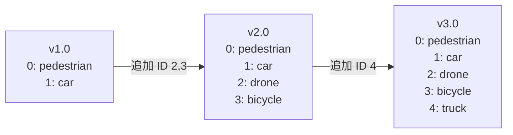
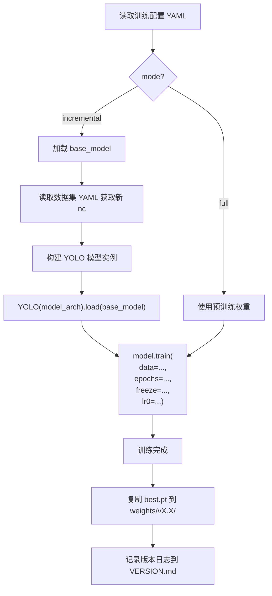
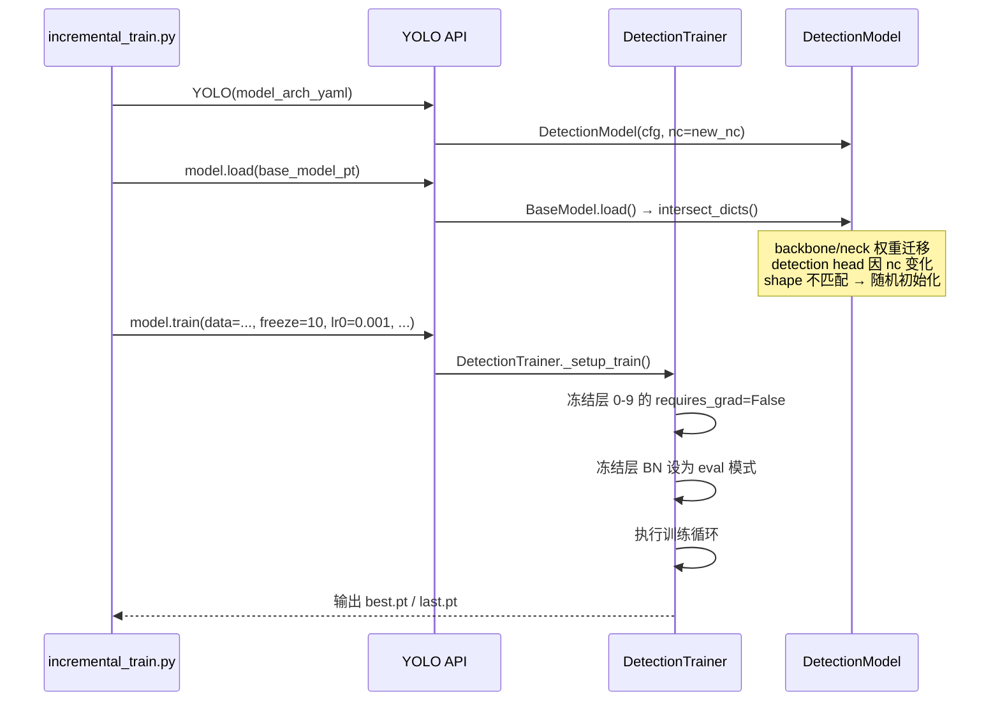
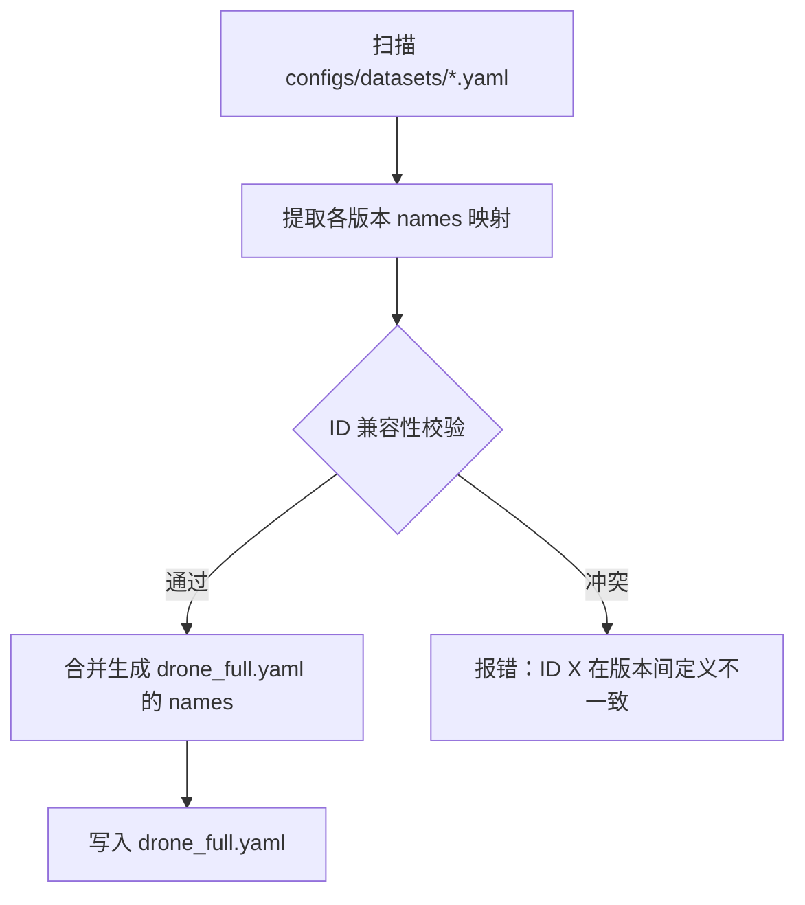
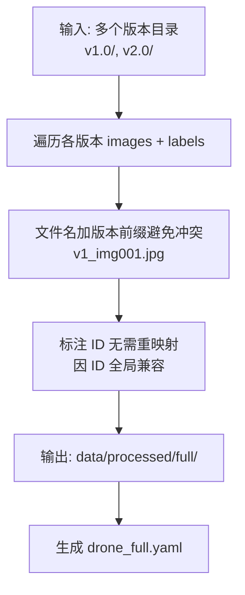
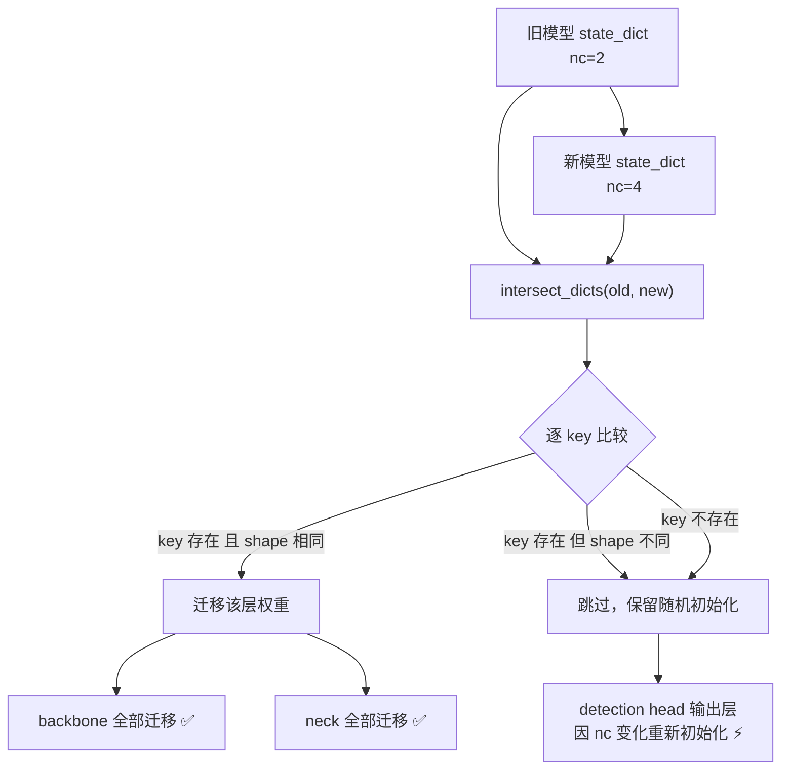
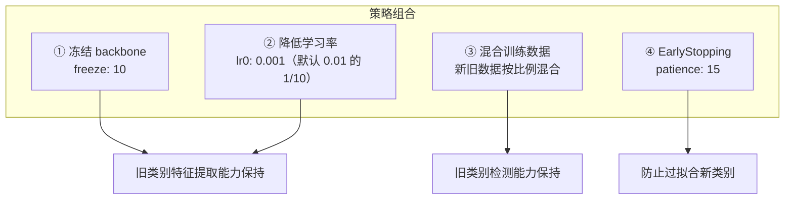
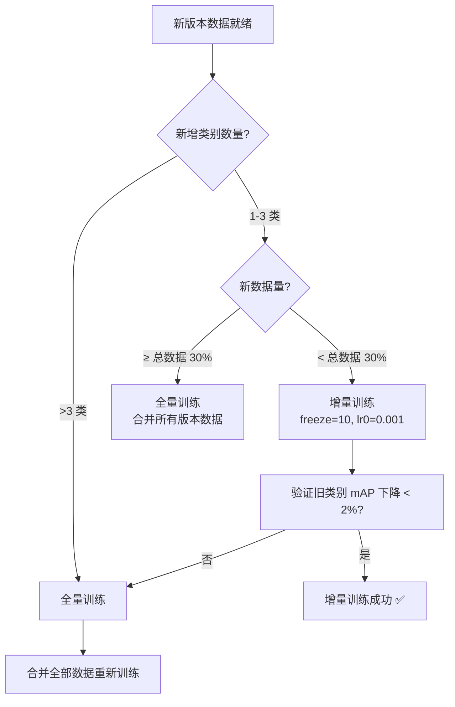
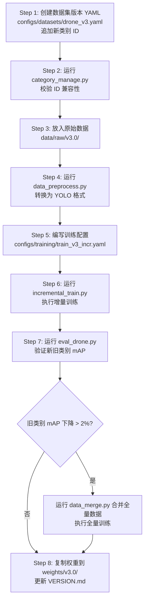

# 无人机动态扩展目标检测训练框架 — 审查与实现方案

## 一、Overview

基于 Ultralytics YOLOv8 8.4.8 源码，构建支持**类别逐步扩充、数据集版本化管理、增量训练**的无人机目标检测工程化框架。核心原则：最大程度复用 Ultralytics 原生能力，仅通过配置驱动和外围脚本实现扩展，不修改 `ultralytics/` 源码。

---

## 二、原文档审查分析

### 2.1 审查结论矩阵

| 设计点 | 评价 | 问题说明 |
|---|---|---|
| 类别与代码解耦 | ✅ 合理 | 原则正确，但实现方式需调整 |
| 数据集版本化 | ✅ 合理 | 目录分版本管理思路正确 |
| 增量训练 | ⚠️ 方向正确、细节不足 | 缺少检测头适配、权重迁移机制说明 |
| 配置体系 (categories/) | ❌ 过度设计 | 与 YOLO 标准数据集 YAML 格式不兼容 |
| 数据集 YAML 格式 | ❌ 不兼容 | 自定义字段无法被 `check_det_dataset()` 解析 |
| 冻结策略 `freeze: [0,1,2]` | ⚠️ 不充分 | YOLOv8 backbone 为层 0-9，仅冻结 0-2 保护不足 |
| 超参文件 hyp_drone_base.yaml | ⚠️ 冗余 | `default.yaml` 已包含全部超参，可通过 CLI 覆盖 |
| 核心脚本功能 | ⚠️ 过度包装 | 大量功能 Ultralytics 原生已支持 |

### 2.2 关键技术问题详述

#### 问题 1：数据集 YAML 与 Ultralytics 标准不兼容

原文档提出的 `drone_v2.yaml` 含自定义字段 `category_config`、`incremental`、`depends_on`：

```
# 原文档格式（不兼容）
category_config: ./configs/categories/v2.0.yaml
incremental: True
depends_on: v1.0
```

Ultralytics `check_det_dataset()` 只解析标准字段：`path`、`train`、`val`、`test`、`names`、`nc`、`download`。自定义字段会被忽略且无法驱动任何行为。

**修正方案**：数据集 YAML 严格遵守标准格式，版本关系在训练配置中管理。

#### 问题 2：类别配置独立拆分不必要

原文档将类别信息拆到 `configs/categories/vX.yaml`，但标准 YOLO 数据集 YAML 已内含 `names` 和 `nc`。拆分导致双重维护，且 Ultralytics 训练器从数据集 YAML 读取 `nc` 和 `names` 并设置到模型上：

```
# ultralytics/models/yolo/detect/train.py
self.model.nc = self.data["nc"]
self.model.names = self.data["names"]
```

**修正方案**：类别定义统一写入数据集 YAML，通过脚本从旧版本 YAML 继承并追加新类别。

#### 问题 3：增量训练核心机制未阐明

Ultralytics `BaseModel.load()` 使用 `intersect_dicts()` 进行**部分权重匹配迁移**：

```
flowchart LR
    A[旧模型 nc=2] -->|load_checkpoint| B[提取 state_dict]
    B -->|intersect_dicts| C{按 key 名 + shape 匹配}
    C -->|backbone/neck 匹配| D[迁移权重]
    C -->|detection head shape 不匹配| E[随机初始化]
    D --> F[新模型 nc=3]
    E --> F
```

当新数据集 `nc` 变化时，`DetectionModel.__init__` 用新 `nc` 构建模型，再 `model.load(old_weights)` 自动完成骨干权重迁移、检测头重建。**无需任何自定义代码**。

#### 问题 4：冻结层范围不充分

原文档 `freeze: [0,1,2]` 仅冻结模型前 3 层。YOLOv8/YOLO26 的 backbone 通常为层 0-9，neck 为层 10-22。防止灾难性遗忘应至少冻结完整 backbone。

---

## 三、Architecture

### 3.1 整体架构

```
graph TB
    subgraph 配置层
        A1[数据集版本 YAML<br/>drone_v1.yaml / drone_v2.yaml]
        A2[训练配置 YAML<br/>train_v2_incr.yaml]
    end

    subgraph 脚本层
        B1[category_manage.py<br/>类别合并]
        B2[data_preprocess.py<br/>数据预处理]
        B3[data_merge.py<br/>数据合并]
        B4[incremental_train.py<br/>增量训练入口]
        B5[eval_drone.py<br/>评估]
        B6[export_model.py<br/>导出]
    end

    subgraph Ultralytics 引擎层 — 不修改
        C1[YOLO API]
        C2[BaseTrainer / DetectionTrainer]
        C3[BaseModel.load - intersect_dicts]
        C4[数据加载 / 增强]
        C5[Exporter]
    end

    subgraph 数据层
        D1[data/raw/vX.X/]
        D2[data/processed/vX.X/]
        D3[weights/vX.X/]
    end

    A1 --> B4
    A2 --> B4
    B1 --> A1
    B2 --> D2
    B3 --> D2
    B4 --> C1
    C1 --> C2
    C2 --> C3
    C2 --> C4
    B5 --> C1
    B6 --> C5
    D1 --> B2
    D2 --> C4
    C2 --> D3
```

### 3.2 项目目录结构

```
drone-yolov8-detection/
├── configs/
│   ├── datasets/                # 数据集版本 YAML（标准 YOLO 格式）
│   │   ├── drone_v1.yaml
│   │   ├── drone_v2.yaml
│   │   └── drone_full.yaml
│   └── training/                # 训练配置（自定义）
│       ├── train_v1.yaml
│       ├── train_v2_incremental.yaml
│       └── train_full.yaml
├── data/
│   ├── raw/                     # 原始数据（按版本）
│   │   ├── v1.0/
│   │   └── v2.0/
│   └── processed/               # YOLO 格式数据（按版本）
│       ├── v1.0/
│       │   ├── images/ (train/ val/ test/)
│       │   └── labels/ (train/ val/ test/)
│       ├── v2.0/
│       └── full/
├── scripts/
│   ├── category_manage.py
│   ├── data_preprocess.py
│   ├── data_merge.py
│   ├── incremental_train.py     # 核心入口
│   ├── train_drone.py
│   ├── eval_drone.py
│   ├── export_model.py
│   └── visualize_results.py
├── weights/
│   ├── pretrained/              # 官方预训练权重
│   ├── v1.0/
│   └── v2.0/
├── runs/                        # 训练输出（自动）
├── ultralytics/                 # 源码（不修改）
├── VERSION.md
└── README.md
```

与原文档差异：
- 移除 `configs/categories/` — 类别信息合并到数据集 YAML
- 移除 `hyp_drone_base.yaml` — 超参直接在训练配置中指定
- `configs/dataset_versions/` 改名为 `configs/datasets/` 并使用标准格式

---

## 四、Data Models — 配置体系设计

### 4.1 数据集版本 YAML（标准 YOLO 格式）

所有数据集 YAML 必须兼容 `check_det_dataset()` 解析。

#### drone_v1.yaml

```yaml
path: ./data/processed/v1.0
train: images/train
val: images/val
test: images/test

nc: 2
names:
  0: pedestrian
  1: car
```

#### drone_v2.yaml（新增类别，ID 必须在旧版本基础上追加）

```yaml
path: ./data/processed/v2.0
train: images/train
val: images/val
test: images/test

nc: 4
names:
  0: pedestrian
  1: car
  2: drone
  3: bicycle
```

#### drone_full.yaml（全量合并数据集）

```yaml
path: ./data/processed/full
train: images/train
val: images/val
test: images/test

nc: 4
names:
  0: pedestrian
  1: car
  2: drone
  3: bicycle
```

**关键约束：新版本类别 ID 必须向后兼容，只能追加不能修改已有 ID 映射。**

### 4.2 训练配置 YAML（自定义格式，脚本解析）

训练配置独立于 Ultralytics 标准，由 `scripts/incremental_train.py` 解析并转换为 YOLO API 调用参数。

#### train_v2_incremental.yaml

```yaml
# 版本信息
version: v2.0
mode: incremental          # incremental | full

# 模型配置
base_model: ./weights/v1.0/best.pt    # 增量训练基础模型
model_arch: yolo26n.yaml              # 模型架构（用于构建新 nc 的模型）

# 数据配置
data: ./configs/datasets/drone_v2.yaml

# 训练超参
epochs: 50
batch: 16
imgsz: 640
lr0: 0.001                 # 增量训练使用较低学习率
lrf: 0.01
patience: 15
device: 0

# 冻结策略
freeze: 10                 # 冻结 backbone（层 0-9）

# 输出配置
project: ./runs
name: train_v2_incremental

# 无人机场景增强
scale: 0.9                 # 更大的缩放范围适配多尺度
mosaic: 1.0
mixup: 0.1
degrees: 10.0              # 旋转增强
perspective: 0.001          # 透视变换
```

### 4.3 类别 ID 兼容性规则



规则：
1. 已分配的 `ID → 类名` 映射不可变
2. 新类别只能追加到最大 ID 之后
3. `category_manage.py` 负责校验兼容性

---

## 五、Business Logic Layer — 核心脚本架构

### 5.1 增量训练脚本 (incremental_train.py) — 核心

这是整个框架最核心的脚本，负责将训练配置翻译为 Ultralytics API 调用。

#### 执行流程



#### 与 Ultralytics 的交互方式



### 5.2 类别管理脚本 (category_manage.py)



**校验逻辑**：对所有版本的 `names` 字典，检查相同 ID 是否映射到相同类名。

### 5.3 数据预处理脚本 (data_preprocess.py)

输入输出关系：

| 步骤 | 输入 | 输出 |
|---|---|---|
| 格式转换 | `data/raw/vX.X/` (VOC/COCO/自定义) | YOLO 格式 txt 标注 |
| 数据集划分 | 全部图片+标注 | `images/{train,val,test}/` + `labels/{train,val,test}/` |
| 增强生成 | 训练集图片 | 离线增强样本（可选） |
| 输出 | — | `data/processed/vX.X/` |

### 5.4 数据合并脚本 (data_merge.py)



**关键**：由于类别 ID 全局兼容（§4.3 规则），合并数据时标注文件中的类别 ID 无需任何转换。

### 5.5 评估脚本 (eval_drone.py)

基于 `model.val()` 封装，增加无人机场景特定指标：

| 指标 | 说明 | 实现方式 |
|---|---|---|
| mAP@0.5 | 标准指标 | `model.val()` 原生输出 |
| mAP@0.5:0.95 | 标准指标 | `model.val()` 原生输出 |
| 小目标 AP | 面积 < 32² 像素的目标 AP | 按 bbox 面积过滤后单独计算 |
| 各版本类别 AP | 分版本查看新旧类别性能 | 按类别分组汇总 |

### 5.6 导出脚本 (export_model.py)

封装 `model.export()`，支持导出格式：

| 格式 | 用途 | 命令参数 |
|---|---|---|
| ONNX | 通用推理 | `format='onnx'` |
| TensorRT (FP16) | GPU 高性能部署 | `format='engine', half=True` |
| TensorRT (INT8) | GPU 极致性能 | `format='engine', int8=True` |
| OpenVINO | Intel 平台 | `format='openvino'` |

---

## 六、增量训练核心机制 — 权重迁移与遗忘防护

### 6.1 权重迁移原理（基于 Ultralytics 原生 intersect_dicts）

`BaseModel.load()` 的核心逻辑：



以 YOLOv8n 为例，nc 从 2→4 时受影响的层：

| 模型部分 | 层索引 | 参数 shape 变化 | 是否迁移 |
|---|---|---|---|
| Backbone (Conv/C2f) | 0-9 | 不变 | ✅ 迁移 |
| Neck (SPPF/Upsample/Concat/C2f) | 10-21 | 不变 | ✅ 迁移 |
| Detect Head (cv2 分支) | 22 | 不变（bbox 回归） | ✅ 迁移 |
| Detect Head (cv3 分支) | 22 | `[..., nc*reg]` → 变化 | ❌ 重初始化 |

### 6.2 灾难性遗忘防护策略



**推荐冻结配置**：

| 场景 | freeze 值 | 说明 |
|---|---|---|
| 新增少量类别（1-3 类） | `10` | 冻结完整 backbone |
| 新增较多类别（>3 类） | `0`（不冻结） | 需要 backbone 也适应新特征 |
| 数据量极少 | `22`（近乎全冻结） | 仅训练最后检测头 |

### 6.3 增量 vs 全量训练决策



---

## 七、标准操作流程 — 新增类别/数据



---

## 八、无人机场景专项优化

### 8.1 数据增强配置

针对无人机场景特点，在训练配置中调整以下超参：

| 超参 | 默认值 | 无人机推荐值 | 理由 |
|---|---|---|---|
| `scale` | 0.5 | 0.9 | 无人机高度变化导致目标尺度变化大 |
| `degrees` | 0.0 | 15.0 | 模拟飞行姿态导致的旋转 |
| `perspective` | 0.0 | 0.001 | 模拟视角倾斜 |
| `shear` | 0.0 | 5.0 | 模拟风吹抖动 |
| `mosaic` | 1.0 | 1.0 | 保持，有助于小目标训练 |
| `mixup` | 0.0 | 0.15 | 增强鲁棒性 |
| `imgsz` | 640 | 640 或 1280 | 小目标场景建议 1280 |

### 8.2 小目标优化策略

| 策略 | 实现方式 |
|---|---|
| 大输入分辨率 | `imgsz: 1280` |
| 增大 box loss 权重 | `box: 10.0`（默认 7.5） |
| 切片推理 (SAHI) | 使用 `ultralytics` 已集成的 SAHI 方案 |
| mosaic 增强 | 默认开启，自然增加小目标密度 |

---

## 九、Testing

### 9.1 测试策略

| 测试类型 | 测试内容 | 验证标准 |
|---|---|---|
| 配置校验 | `category_manage.py` ID 兼容性校验 | 检测 ID 冲突并报错 |
| 数据完整性 | 预处理后图片-标注对应关系 | 100% 图片有对应标注文件 |
| 增量训练回归 | 增量训练后旧类别 mAP | 下降不超过 2% |
| 权重迁移 | `intersect_dicts` 迁移的参数比例 | backbone+neck 层 100% 迁移 |
| 导出一致性 | ONNX 推理结果 vs PyTorch 推理结果 | 精度差异 < 0.1% |
| 端到端流程 | 从原始数据到模型导出的完整流程 | 无报错，输出有效模型 |
